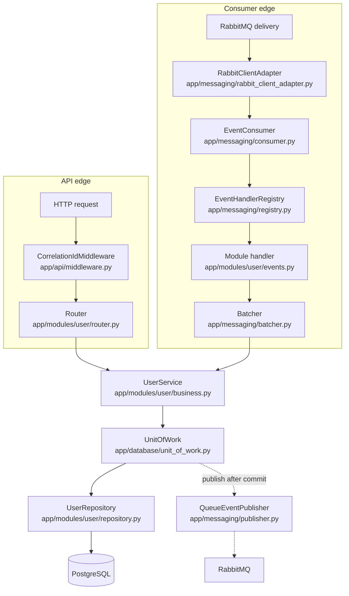
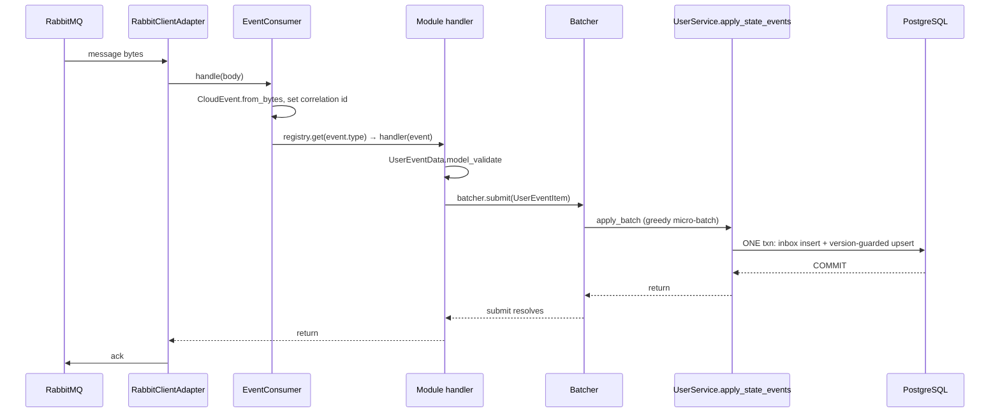

# Architecture Tour

This chapter is the map. It walks both edges of the service — an HTTP write
and a consumed event — through every layer they touch, then explains the
three structural decisions everything else hangs off: two object graphs, one
`UnitOfWork` contract, and loud supervision. The [Adding a
Module](05-adding-a-module.md) chapter shows *what to type*; this one
explains *why it's shaped this way*.

## The layers

Two entry edges, one business core, one database:



The dependency rules are absolute, and every one of them is visible in the
imports:

| Rule | Enforced where |
|---|---|
| API → business → repository → database; each layer sees only the next | `app/modules/user/router.py` imports `UserService`, never `UserRepository` |
| Consumer edge → business, never repositories | `app/modules/user/events.py` submits to a `Batcher` wrapping `UserService.apply_state_events` |
| Business imports neither FastAPI nor RabbitMQ | `app/modules/user/business.py` — check its imports; there are none of either |
| Modules never touch another module's repository | modules communicate through events only; nothing in one module may import a sibling module's data access |
| Concrete classes meet only in the composition root | `app/bootstrap/container.py` — everything else takes constructor-injected protocols |

!!! note "Why the business layer is framework-free"
    `UserService` is called by both edges. If it imported FastAPI it couldn't
    run in the headless consumer; if it imported RabbitMQ the consumer graph
    couldn't suppress publishing. Keeping it pure is what makes the
    two-graphs trick below possible.

## Walk a write request end to end

`POST /users`, from TCP to response:

1. **Correlation id.** `CorrelationIdMiddleware` (`app/api/middleware.py`, a
   pure ASGI middleware — no `BaseHTTPMiddleware` task group) reads
   `X-Correlation-ID` from the request or mints one via
   `set_correlation_id()`, stamps it on the response headers, and logs one
   structured access line per request (method, path, status, duration).
2. **Router translates.** `build_user_router` in `app/modules/user/router.py`
   converts the `UserCreate` schema into a `UserData` model (filling in
   `uuid4()` if the client sent no id) and calls
   `UserService.create`. Nothing else — thin translation only. Both types
   are declared with the same shared Annotated types
   (`app/modules/shared/validation.py`), so constructing the `UserData` IS
   the business validation — same rules, one definition.
3. **Service opens a UnitOfWork.** `create` receives an already-valid
   `UserData` (valid by construction — there are no validation calls in the
   service) and enters `async with self._uow_factory() as uow` — one
   transaction for the whole request.
4. **Idempotent insert.** `repo.insert_if_absent(User(...))` either inserts
   the row or returns `None` because the id already exists. On replay with
   identical content the stored row is returned with HTTP 200 (the router
   downgrades the default 201) — and the service **re-announces** the stored
   `user.created` event, recovering a publish that may have been lost in the
   ambiguous commit window. Contradictory content for an existing id raises
   `ConflictError`.
5. **Events are staged, not sent.** `uow.stage_event(...)` appends a
   `CloudEvent` (built by `build_user_event` in
   `app/modules/user/events.py`: full state + version + the current
   correlation id) to an in-memory list. Nothing hits RabbitMQ yet.
6. **Commit, then publish.** `uow.commit()` commits the PostgreSQL
   transaction, and only afterwards hands each staged event to
   `QueueEventPublisher.publish_event`, which sends it to
   `settings.publish_queue`.
7. **Error mapping.** Domain exceptions cross the API edge exactly once, in
   `register_error_handlers` (`app/api/errors.py`):

    | Domain exception (`app/modules/shared/errors.py`) | HTTP status |
    |---|---|
    | `NotFoundError` | 404 |
    | `ConflictError` | 409 |
    | `InvalidInputError` | 400 |
    | any other `DomainError` | 500, logged as `unmapped domain error` |

    Every error body is `{"detail": <message>, "correlation_id": <id>}` — the
    id you hand a caller is the id you grep the logs for.

## Walk a consumed event end to end



Step by step:

1. **Ack semantics come from the client.** `RabbitClientAdapter`
   (`app/messaging/rabbit_client_adapter.py`) is the only module that touches
   `RabbitClient`: handler **return = ack**, handler **raise = nack +
   requeue**. Every decision below is expressed in those two verbs.
2. **Decode.** `EventConsumer._handler_for` parses the body with
   `CloudEvent.from_bytes` (`app/messaging/cloudevents.py` — CloudEvents 1.0
   in structured JSON mode, because RabbitClient handlers get raw bytes with
   no AMQP headers). An invalid envelope is logged and **returned** — acked
   away, never poison-looped.
3. **Correlation id from the event.** `set_correlation_id(event.correlationid
   or event.id)` — a consumed event's log lines join the trace the producer
   started.
4. **Failures are classified at dispatch, not in handlers.** The
   permanent/transient taxonomy lives in `EventConsumer`, so every module —
   current and future — is poison-safe by construction. Permanent (invalid
   envelope, unknown type, `ValidationError` from the payload, a
   deterministic storage rejection detected by `is_permanent_data_error` in
   `app/database/errors.py`, which classifies by SQLSTATE — the SQL-standard
   error code; class 22 is "data exception") → log +
   return → ack. Transient (database down, `BatcherClosedError`) → raise →
   requeue → retry.
5. **Registry lookup.** `EventHandlerRegistry.get(event.type)` returns the
   handler that `register_user_event_handlers` registered at bootstrap for
   `user.created` / `user.updated`; unknown types are logged and acked away.
6. **Handler validates and submits.** The handler validates `event.data` as
   `UserEventData` (a permissive floor — see the [Reliability
   Model](04-reliability-model.md) for why the consumer path accepts what
   the API would 422) and calls `batcher.submit(UserEventItem)`.
7. **Greedy micro-batch.** The `Batcher` (`app/messaging/batcher.py`) never
   waits to fill a batch: idle traffic gets batches of one (zero added
   latency); batches grow only while a previous commit is in flight. This
   exists because one PostgreSQL commit per message caps throughput at the
   database's fsync rate.
8. **One transaction per batch.** `UserService.apply_state_events` runs:
   `uow.mark_events_processed` (bulk inbox insert into `processed_events`,
   duplicates filtered by `RETURNING`), highest-version-per-user wins within
   the batch, then `upsert_if_newer_many` — a single atomic
   `INSERT .. ON CONFLICT DO UPDATE` guarded by `stored.version <
   new.version`, evaluated by PostgreSQL, no row locks. Then `uow.commit()`.
9. **Ack strictly after durability.** `submit()` resolves only after the
   batch's COMMIT; the handler returns; RabbitClient acks. At-least-once,
   exactly as if there were no batching. Each flush runs under its own fresh
   correlation id (a batch merges many message contexts); per-event ids are
   logged at DEBUG.

## Two object graphs, one codebase

The composition root — `Container.__init__` in
`app/bootstrap/container.py` — is the **only** place concrete classes meet.
It wires the *same* `UserService` class twice, differing in exactly one
constructor argument:

| Graph | UnitOfWork carries | Effect |
|---|---|---|
| API | `QueueEventPublisher(bus, settings.publish_queue)` | committed events are published to the outbound queue |
| Consumer | `NullEventPublisher()` | staged events are logged at DEBUG and dropped — the consumer can never republish, **by construction** |

!!! note "Why not an `if consumer:` flag?"
    A flag inside the business layer is a rule someone can forget to check on
    the next code path. Wiring `NullEventPublisher` into the consumer graph
    makes republishing structurally impossible — there is no code path that
    could do it, so no review needs to guard it. `UserService` contains not a
    single conditional about which edge called it.

The consumer graph is built by `Container._build_consumer_graph`: its own
`UserService` (null publisher), a `Batcher` wrapping `apply_state_events`
with `settings.consumer_batch_size` as the ceiling, an
`EventHandlerRegistry` filled by `register_user_event_handlers`, and an
`EventConsumer` over `settings.consume_queues`.

## The UnitOfWork contract

`SqlAlchemyUnitOfWork` (`app/database/unit_of_work.py`) owns the only
commit/rollback in the system. The contract every caller relies on:

- **One UoW per API request / consumed batch.** Instances are single-use;
  the factories (`functools.partial` in the container) build a fresh one
  each time.
- **Repositories join, never commit.** A repository is constructed with
  `uow.session` and issues statements on it; the UoW alone decides the
  transaction's fate.
- **`stage_event` → `commit` publishes strictly after.** Events accumulate
  in `_staged`; `commit()` first commits the session, then hands each event
  to the injected publisher. A failed commit publishes nothing.
- **Rollback discards staged events.** `__aexit__` without a prior commit
  rolls back, and the staged list dies with the single-use instance.
- **Read paths return usable objects without a magic commit.** A clean
  read-only exit calls `session.expunge_all()` *before* the rollback,
  detaching ORM instances so business code can return them after the
  session closes. (The design notes in `docs/architecture.md` phrase this as
  "read paths also commit"; the code achieves the same effect — usable
  instances, no lingering transaction — via expunge-then-rollback.)
- **`mark_events_processed` lives here**, not in any module's repository,
  because consumer idempotency is delivery infrastructure shared by every
  module.

If a publish fails *after* the commit succeeded, the write stands, the
caller sees success, and the loss is logged loudly with the event ids — the
[Reliability Model](04-reliability-model.md) owns the full analysis of this
gap and the Outbox that closes it.

## Supervision & lifecycle

`SDS_SERVICE_MODE` selects what a process runs (`main.py`):

| Mode | Entry path | What starts |
|---|---|---|
| `api` | `uvicorn` → `create_app_from_env` (`app/bootstrap/api_app.py`) | HTTP only; lifespan calls `container.start()` |
| `consumer` | `consumer_runner.main()` → `run_consumer` (`app/bootstrap/consumer_runner.py`), no HTTP | `container.start()` + `container.start_consumer()`, awaited until cancelled — the process exits if the consumer task ever completes |
| `both` (default) | `uvicorn`, same factory | the lifespan starts the container **and** the consumer task |

The lifespan in `app/api/app.py` owns shutdown symmetrically: `finally:
await container.stop()`, so nothing can raise past it and leak the engine or
bus.

Supervision facts, each grounded in `app/bootstrap/container.py` and
`app/messaging/consumer.py`:

- **The container owns the consumer task.** `start_consumer()` creates it
  (`name="event-consumer"`) and attaches `_on_consumer_done`: **any**
  uncancelled completion — crash *or* clean return — is logged `CRITICAL`
  ("event consumer stopped — no events are being consumed"). A clean return
  is just as dead as a crash, because `run()` parks forever on a real bus.
- **A dead consumer flips `/ready`.** `Container.readiness()` reports
  `consumer: false` once the task is done (checked only in `consumer`/`both`
  modes), alongside `database` (a `SELECT 1` with a 2 s timeout) and
  `rabbitmq` (`bus.is_connected()` — the connection's live `connected`
  event, not `is_closed`, which stays false during a reconnect loop).
  `/ready` in `app/api/health.py` returns 503 unless every check passes;
  `/health` is liveness only, always 200. [Operations](07-operations.md)
  covers how these are probed in deployment.
- **Per-queue independent retry.** `EventConsumer.run()` spawns one task per
  configured queue; `_consume_forever` catches any non-cancellation failure,
  logs it, sleeps `retry_delay` (5 s default), and retries. One bad queue
  neither kills nor hides the others.
- **The Basic.Cancel watchdog.** RabbitClient's `consume()` runs a watchdog
  that detects a broker-side `Basic.Cancel` (queue deleted) — aio-pika
  swallows the cancel silently and only restores consumers on reconnect, so
  without it a deleted queue is an invisible outage. Since hs-rabbit-client
  0.2.0 recovery is internal to the library: it logs a WARNING on the
  `hs_rabbit_client` logger, backs off 1 s, then re-declares and resumes —
  nothing reaches `_consume_forever`'s retry loop.
- **Restart-safe `start()`.** `Container.start()` checks
  `self.user_batcher.closed` and rebuilds the whole consumer graph if a
  previous `stop()` closed it — a closed batcher fails every `submit` with
  `BatcherClosedError`, so a restarted consumer would otherwise look healthy
  while nacking everything forever.
- **Shutdown order matters.** `stop()` cancels the consumer task (stop
  pulling deliveries), closes the batcher (pending items fail with
  `BatcherClosedError`, a plain `Exception`, so their handlers nack while
  the channel is still open), then closes the bus, then disposes the engine.
- **Settings refuse silent no-ops.** `Settings` in `app/config/settings.py`
  rejects `consumer`/`both` modes with an empty `consume_queues` — otherwise
  the process would start, consume nothing, and look successful.

## Directory anatomy

```
app/
  api/          HTTP edge shared by all modules: middleware.py (correlation id),
                errors.py (domain → HTTP mapping), health.py (/health, /ready),
                app.py (FastAPI assembly — receives the wired container)
  bootstrap/    composition root: container.py (the ONLY place concretes meet),
                api_app.py (uvicorn factory), consumer_runner.py (headless mode)
  config/       settings.py — every knob, env-prefixed SDS_, validated at load
  database/     engine.py (pool), unit_of_work.py (the one commit in the system),
                inbox.py (processed_events dedup table), errors.py (SQLSTATE
                classification), storable.py (NUL/NaN floor), base.py (Base)
  logging/      setup.py (structured logging owns the root logger),
                correlation.py (contextvar-backed correlation id)
  messaging/    RabbitMQ edge: rabbit_client_adapter.py (the ONE seam over RabbitClient),
                consumer.py (dispatch + failure taxonomy), registry.py,
                batcher.py, publisher.py, cloudevents.py (envelope)
  modules/
    shared/     cross-module vocabulary AND machinery: errors.py (DomainError
                family), validation.py (the shared floor), query.py
                (paging/sort/filter), repository.py (VersionedRepository —
                idempotent insert, version-guarded upsert, whitelisted list),
                service.py (VersionedEntityService — the whole create/update/
                apply-events choreography), events.py (envelope + registration)
    user/       one complete module — only what is user-SPECIFIC: model.py,
                repository.py (whitelists), business.py (data shapes + hooks),
                schemas.py, events.py, router.py — the template for every next one
main.py         mode switch: api/both → uvicorn, consumer → asyncio runner
```

The rule of thumb: `api/`, `messaging/`, `database/`, `logging/` are
*infrastructure shared by every module*; `modules/<entity>/` is *everything
about one entity*; `bootstrap/` is the only place the two meet. Adding an
entity means one new module directory plus bootstrap wiring — nothing else
changes. That is the whole point of the shape, and
[Adding a Module](05-adding-a-module.md) walks it end to end.
