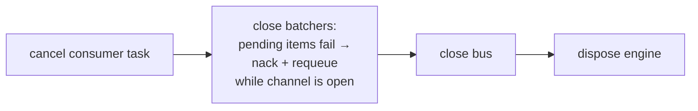

# Operations Runbook

Everything the on-call needs: what runs, how to tell it is healthy, what the
loud log lines mean, and what to do for each failure mode. Mechanism details
live in the [Reliability Model](04-reliability-model.md); local bring-up is in
[Setup](02-setup.md).

## Process shapes

`SDS_SERVICE_MODE` (see `app/config/settings.py`, default `both`) selects what
an instance runs — `main.py` dispatches on it:

| Mode | What runs | HTTP? | `/ready` checks |
|---|---|---|---|
| `api` | uvicorn serving the REST API | Yes | `database`, `rabbitmq` |
| `consumer` | headless consumer loop (`app/bootstrap/consumer_runner.py`) | **No** — no HTTP server at all | not served over HTTP |
| `both` | API + supervised consumer task in one process | Yes | `database`, `rabbitmq`, `consumer` |

The `consumer` key is added by `Container.readiness()`
(`app/bootstrap/container.py`) only when `service_mode` is `consumer` or
`both` — an `api`-only instance is never marked unready for a consumer it
doesn't run. Since `consumer` mode has no HTTP listener, probe those pods by
process liveness — which is sufficient, because the runner
(`app/bootstrap/consumer_runner.py`) *awaits* the supervised consumer task:
any uncancelled completion ends the await, runs `stop()`, and **exits the
process**. A consumer-mode pod cannot linger alive with a dead consumer; in
`both` mode the process stays up and the `/ready` flip is the signal instead.

Settings refuse to start a consuming mode with an empty
`SDS_CONSUME_QUEUES` — otherwise the process would start, consume nothing,
and exit 0 looking successful.

## Health vs readiness

Both endpoints are built in `app/api/health.py`.

| Endpoint | Meaning | Response |
|---|---|---|
| `GET /health` | Liveness: the process is up. | Always `200` with body `{"status": "ok"}` — no dependency checks. |
| `GET /ready` | Dependencies usable. | JSON object of per-check booleans, e.g. `{"database": true, "rabbitmq": true, "consumer": true}`. `200` when **all** are true, `503` otherwise — the body still lists every check, so the failing one is visible in the probe response. |

What each check actually verifies, and the first move when it is `false`:

| Check | How it is verified | If `false`, first do |
|---|---|---|
| `database` | `SELECT 1` on the engine with a 2-second `asyncio.wait_for` timeout; failure also logs WARNING `readiness: database check failed` with the stack trace. | Check PostgreSQL itself (up? connection limit? network?) — the exc_info in that WARNING names the real cause. |
| `rabbitmq` | The client's **live `connected` event** — deliberately *not* `is_closed`, because `is_closed` stays `false` while the client is stuck in a reconnect loop and would report a down broker as healthy. | Check the broker and the AMQP URL; the RabbitClient reconnects on its own once the broker returns. |
| `consumer` | The supervised consumer task exists and has not completed. Any uncancelled completion — crash *or* clean return — is dead. | Look for the CRITICAL line below, then restart the instance. |

## Log format

Logging is JSON-lines on stdout (`app/logging/setup.py`), level controlled by
`SDS_LOG_LEVEL` (default `INFO`); uvicorn access logs and aio-pika/aiormq
chatter are capped at WARNING so the stream stays greppable. Every record
carries `ts`, `level`, `logger`, `message`, `correlation_id`, plus any
structured `extra` fields; stack traces appear as `exc_info`. Payload bodies
and secrets are never logged — identifiers are.

Correlation ids (`app/logging/correlation.py`, `app/api/middleware.py`):

- **Inbound HTTP**: the `X-Correlation-ID` request header is honored; if
  absent, a UUID4 hex is minted. The id is echoed back on the response's
  `X-Correlation-ID` header, and one structured access line
  (`request handled`, logger `app.api.access`, with method/path/status/
  duration_ms) is logged per request.
- **Events**: outgoing CloudEvents carry a `correlationid` attribute set from
  the current context; the consumer adopts `event.correlationid` (falling
  back to the event id) before dispatch — so one id traces a write from the
  API through the broker into the consumer's *dispatch* lines. One caveat
  when grepping: the batch commit line (`… events applied`) runs under a
  fresh per-flush id, because one batch merges many message contexts —
  per-event ids appear there only at DEBUG. Not finding the producer's id on
  a commit line does **not** mean the event wasn't applied.
- Outside any request/message context the field logs as `-`.

## CRITICAL / ERROR / WARNING log catalog

Exact message strings, from the code. CRITICAL means page-worthy.

| Level | Message | Source | Meaning | Operator action |
|---|---|---|---|---|
| CRITICAL | `event consumer stopped — no events are being consumed` | `app/bootstrap/container.py` | The supervised consumer task completed without being cancelled — crash or clean return, both equally dead. `/ready` `consumer` flips false. | Restart the instance; investigate the attached exception (if any). |
| CRITICAL | `commit failed with staged events; if the commit actually applied, these events were NOT published` | `app/database/unit_of_work.py` | Ambiguous outcome: the COMMIT errored *after* the database may have applied it. If it applied, the staged events (ids/types in the log) will never be published. | Check whether the rows exist. For creates, a client retry re-announces the stored state; a lost `user.updated` has no re-announce path until the Outbox lands — reconcile downstream replicas manually if it matters. |
| CRITICAL | `cancelled during post-commit publish; remaining events were NOT published` | `app/database/unit_of_work.py` | Cancellation (client disconnect, shutdown) hit mid-publish after a successful commit. The commit stands; the listed event ids were not announced. | Same as above: the data is safe, the announcements listed in `event_ids` are lost. |
| ERROR | `event publish failed after commit` | `app/database/unit_of_work.py` | The known commit-succeeds-publish-fails gap: one event failed to publish (broker down, channel error). The request still succeeds — the write must not be undone. Logged per event with `event_id`/`event_type` and stack trace. | Fix the broker. Same recovery asymmetry as above (creates re-announce on retry, updates are superseded by the next update). |
| WARNING | `invalid CloudEvent rejected` | `app/messaging/consumer.py` | Message body is not a valid CloudEvent envelope. Acked away — permanent. | Find the producer sending garbage to the queue; the `reason` field says what failed. |
| WARNING | `unknown event type rejected` | `app/messaging/consumer.py` | Valid envelope, but no handler registered for `event_type`. Acked away. | Either the producer is emitting a new type, or this service is missing a handler registration in bootstrap. |
| WARNING | `event payload rejected` | `app/messaging/consumer.py` | Envelope fine, payload failed validation (permanent). Acked away; `reason` lists field locations + messages, never values. | Fix the producer's payload; the event id/type identify the message. |
| WARNING | `unstorable event rejected` | `app/messaging/consumer.py` | The database deterministically rejected the data (SQLSTATE class 22) — retrying can never succeed. Acked away. | As above — producer-side data problem that slipped past validation. |
| WARNING | `readiness: database check failed` | `app/bootstrap/container.py` | The `/ready` database probe failed (with stack trace). | Treat as PostgreSQL trouble; see failure modes. |
| WARNING | `batch apply failed; retrying items individually` | `app/messaging/batcher.py` | A consumer micro-batch failed as a whole; items are being retried one by one so a poison item fails alone. Routine self-healing, not an outage. | Only investigate if it repeats — the follow-up per-item logs identify the culprit. |
| WARNING | `consumer cancelled by broker; re-declaring and resuming` | `app/messaging/consumer.py` | The broker cancelled one queue's consumer (queue deleted/recreated); the loop re-declares and resumes after `retry_in_s` (5 s) without touching other queues. Expected operational event, no traceback. | If it repeats every 5 s, something keeps deleting the queue — see failure modes. |
| ERROR | `consume failed; retrying` | `app/messaging/consumer.py` | One queue's consume loop failed with an unexpected error (channel/protocol fault); it retries in `retry_in_s` (5 s) without touching other queues. | If it repeats every 5 s, investigate the traceback — this is not the queue-deleted case (that one is the WARNING above). |

!!! note "Rejections are acks, not losses of control"
    Every WARNING-level rejection above ends in an **ack**: the message is
    deliberately removed so it cannot poison-loop. A rejected event is a
    producer bug to chase, not a pipeline failure to firefight.

## Failure modes

| Failure | Symptom | Blast radius | Action |
|---|---|---|---|
| **PostgreSQL down** | API requests fail with HTTP 500 (`app/api/errors.py` maps only domain errors — `NotFoundError`→404, `ConflictError`→409, `InvalidInputError`→400; infrastructure exceptions surface as unhandled 500s). Consumer: handler raises → transient → nack + requeue, messages redeliver. `/ready` → `database: false`, 503. | All reads and writes stop; **nothing committed is lost** and consumed messages wait in the queue. | Restore PostgreSQL. The backlog drains on its own; idempotency makes redelivery harmless. |
| **RabbitMQ down** | API writes still commit, but each event logs ERROR `event publish failed after commit`. `/ready` → `rabbitmq: false`. Consumer sits idle; RabbitClient reconnects automatically. | Data intact; downstream replicas fall behind. Events for updates during the outage are the known gap (see catalog). | Restore the broker; verify readiness returns true on its own. Assess whether any `user.updated` announcements were lost. |
| **A consumed queue deleted** | RabbitClient's watchdog turns the broker-side Basic.Cancel into a raise (aio-pika would swallow it silently); that queue's loop logs the WARNING `consumer cancelled by broker; re-declaring and resuming` every 5 s (a constructor default, not env-tunable). | Only that queue — each queue is independently supervised; the others keep consuming. **Messages that were in the queue at deletion are gone.** | Usually nothing: the service declares its queues itself (durable, on both the consume and publish side), so the next retry **re-declares the queue empty** and consumption resumes without a restart. Removing it from `SDS_CONSUME_QUEUES` instead is a config change + restart. |
| **Poison messages** | WARNING rejections from the catalog above; messages acked away. | None — this is the defense working, not failing. Throughput and other messages are unaffected. | Use the logged event id/type to find and fix the producer. |
| **Consumer task dead** | CRITICAL `event consumer stopped — no events are being consumed`; `/ready` → `consumer: false`, 503. | That instance consumes nothing; other consumer instances are unaffected. | Restart the pod/process — the readiness flip is designed to trigger exactly that in an orchestrator. |

## Scaling

The service is stateless: all coordination state (inbox dedup, versions, row
locks) lives in PostgreSQL, so you can run **N `api` instances + M `consumer`
instances** with no leader election and no sticky sessions. The knobs, all
env vars from `app/config/settings.py`:

| Knob | Default | Trade-off |
|---|---|---|
| `SDS_PREFETCH` | 500 | Max unacked deliveries in flight per consumer. Higher feeds bigger micro-batches (throughput); it also bounds how many messages redeliver after a crash. |
| `SDS_CONSUMER_BATCH_SIZE` | 200 | Upper bound of one consumer transaction. The batcher is greedy and never waits to fill it, so raising it adds throughput headroom under backlog and zero latency when idle. |
| `SDS_DB_POOL_SIZE` / `SDS_DB_MAX_OVERFLOW` | 10 / 20 | Concurrent DB work per process. Size against PostgreSQL's `max_connections` across *all* instances. |

The `scaling` section of `scripts/benchmark.py` measures exactly this: the
same API and consumer loads against 1 vs 4 processes.

!!! note "Two deployment footnotes"
    - `SDS_API_HOST` defaults to `127.0.0.1` — fine on a laptop, invisible
      from outside a container. Set `SDS_API_HOST=0.0.0.0` in containerized
      deployments.
    - The `processed_events` inbox table grows without bound (one row per
      consumed event, no automatic retention). Prune it periodically — rows
      whose `processed_at` is older than any plausible redelivery window
      (days, not minutes) are safe to delete; deleting a row only matters if
      that exact event were redelivered afterwards.

## Benchmarks

`scripts/benchmark.py` runs four scenario groups against the real stack
(PostgreSQL + RabbitMQ + uvicorn):

1. `postgres` — DAL throughput through the real UnitOfWork/repository
   (create, get, list; sequential and concurrent).
2. `api` — HTTP throughput + p50/p95/p99 latency for POST/GET/PATCH/LIST
   under concurrent load.
3. `rabbit` — end-to-end event path (publish → consumer → committed row):
   throughput and publish→commit latency percentiles.
4. `scaling` — the same loads against 1 vs 4 processes (client-side
   round-robin = horizontal scaling).

Run it with `.venv/bin/python scripts/benchmark.py` (add `--quick` for a
short pass). It prints a report and writes
`scripts/benchmark_results.json` next to itself.

Headline numbers from the checked-in results (2026-07-16):

- Burst drain: **~7,000 events/s** consumed, ~6,500/s end-to-end
  publish→commit, single consumer.
- Sustained 1,000 ev/s: p99 publish→commit latency **6.5 ms** with one
  consumer, **3.4 ms** with four.
- API `POST /users`: ~197 req/s at 1 process → **~1,610 req/s at 4
  processes** (p50 dropping from 177 ms to 20 ms at concurrency 50).

!!! warning "Dev-machine numbers"
    These were measured on a development machine. Treat them as relative shape — batching wins,
    near-linear scaling — not as production capacity figures. Re-run the
    suite on representative hardware before sizing anything.

## Shutdown semantics

`Container.stop()` (`app/bootstrap/container.py`) stops in a deliberate
order, and the order is the guarantee:

1. **Cancel the consumer task** — stop pulling new deliveries first.
2. **Close the batcher** — every queued and in-flight item fails with
   `BatcherClosedError`, a plain exception, so RabbitClient **nacks each
   message while the channel is still open** and the broker redelivers.
   Nothing is silently dropped and no handler is left awaiting forever.
3. **Close the bus** — only after the nacks have somewhere to go.
4. **Dispose the engine** — last, so in-flight commits finish.

Reversing steps 2 and 3 would strand unacked messages until the broker
notices the dead connection; this order hands them back immediately.

It is therefore **safe to SIGTERM** an instance at any time: committed work
is durable, uncommitted batch items redeliver, and the inbox + version guard
make the redelivery a no-op beyond the original effect. In `api`/`both`
modes the same `stop()` runs in the FastAPI lifespan on shutdown; the
`consumer` runner does the same in its `finally`. The container is
restart-safe: `start()` after `stop()` rebuilds the consumer graph rather
than reusing a closed batcher.

Next: [Maintenance Contract](08-maintenance.md) — the invariants you must
not break while operating or changing any of the above.
